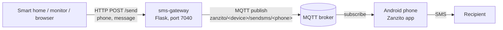

# sms-gateway

SMS Gateway is a small Python (Flask) microservice that lets any system that can make an HTTP
request, such as a smart home controller or a network monitor, send SMS messages. It does not
talk to a mobile carrier itself: it publishes each message to an MQTT broker, and an Android
phone running the **Zanzito** app picks it up and sends the SMS from its own SIM card.
<!-- TODO: verify and add a link to the Zanzito app (Play Store / project page) -->

The service also includes a minimal web page for sending an SMS by hand.

## Table of contents

- [Features](#features)
- [How it works](#how-it-works)
- [Requirements](#requirements)
- [Installation](#installation)
- [Configuration](#configuration)
- [Usage](#usage)
- [API reference](#api-reference)
- [MQTT topic and payload](#mqtt-topic-and-payload)
- [Integration examples](#integration-examples)
- [Security notes](#security-notes)
- [Troubleshooting](#troubleshooting)
- [Development](#development)
- [Contributing](#contributing)
- [License](#license)

## Features

- HTTP endpoint (`/send`) that accepts a phone number and a message as form fields.
- Web UI at `/` with a phone number field, a message box and a **Send SMS** button.
- Publishes each message to MQTT in the topic format that the Zanzito Android app listens on
  (`zanzito/<device>/sendsms/<phone>`).
- No database and no state: one Python file plus a template and static assets.

## How it works



1. A client sends `phone` and `message` to `POST /send` (the web UI does this with jQuery AJAX).
2. `smssender.py` opens a new MQTT connection to the configured broker, authenticates with the
   configured username and password, and publishes the message text to
   `zanzito/<zanzitoDevice>/sendsms/<phone>` with QoS 0, not retained.
3. The Zanzito app on the Android phone, subscribed to that broker, sends the text as an SMS to
   the phone number taken from the topic.
4. The HTTP response is the string form of the paho-mqtt publish result, or the error text if
   something failed.

## Requirements

- Python 3.9 or later (required by current Flask and Werkzeug; tested with Python 3.12).
- An MQTT broker (for example Mosquitto) reachable from both this service and the phone.
- An Android phone with a SIM card and the **Zanzito** app installed, connected to the same
  broker. The device name set in Zanzito's settings must match `zanzitoDevice` (see
  [Configuration](#configuration)).
- Python packages: `flask`, `flask_restful` and `paho-mqtt`.

> **Note:** `requirements.txt` does not list `paho-mqtt`, although `smssender.py` imports it.
> Install it separately (see below). The code calls `mqtt.Client("smsSender")`, which is the
> paho-mqtt 1.x constructor signature. With paho-mqtt 2.x every `/send` request fails with
> `Unsupported callback API version: version 2.0 added a callback_api_version, ...`, so install
> `paho-mqtt<2`.

## Installation

There are no release packages, Docker images or GitHub releases. Run it from source:

```bash
git clone https://github.com/t0mer/sms-gateway.git
cd sms-gateway
python3 -m venv .venv
source .venv/bin/activate
pip install -r requirements.txt
pip install "paho-mqtt<2"
```

Edit the connection settings at the top of `smssender.py` (see [Configuration](#configuration)),
then start the service:

```bash
python3 smssender.py
```

The service listens on `0.0.0.0:7040`. Open `http://<host>:7040/` in a browser.

## Configuration

All settings are hardcoded variables at the top of `smssender.py`. There are no environment
variables, command-line flags or config files.

| Variable | Default | Description |
|---|---|---|
| `server` | `''` (empty) | MQTT broker host name or IP address. Required. |
| `port` | `1883` | MQTT broker port. **Currently not used:** `client.connect(server)` is called without it, so paho-mqtt's default port 1883 is always used. |
| `user` | `''` (empty) | MQTT username. |
| `passw` | `''` (empty) | MQTT password. |
| `zanzitoDevice` | `''` (empty) | The device name you gave the phone in Zanzito's settings. Used in the topic. |

Other values fixed in the code:

| Setting | Value | Where |
|---|---|---|
| HTTP listen address | `0.0.0.0` | `app.run(...)` in `smssender.py` |
| HTTP port | `7040` | `app.run(...)` in `smssender.py` |
| Flask debug mode | `True` | `app.run(...)` in `smssender.py` (see [Security notes](#security-notes)) |
| MQTT client ID | `smsSender` | `sendSms()` in `smssender.py` |
| MQTT QoS / retain | `0` / `False` | `sendSms()` in `smssender.py` |

Because the client ID `smsSender` is fixed, concurrent requests or several running instances
evict each other's connections on the broker.

Example (use your own values; never commit real credentials):

```python
server = 'mqtt.example.lan'   # MQTT Broker Address
port = 1883                   # MQTT Broker Port (currently ignored)
user = 'mqtt-user'            # MQTT Broker Username
passw = 'change-me'           # MQTT Broker Password
zanzitoDevice = 'myphone'     # Name you gave your device in Zanzito settings
```

## Usage

### Web UI

Browse to `http://<host>:7040/`, enter the phone number and the message, and click
**Send SMS**. The page posts the form to `/send` in the background. It shows no confirmation;
the server response is only written to the browser's developer console.

### From the command line

```bash
curl -X POST http://<host>:7040/send \
  --data-urlencode "phone=15551234567" \
  --data-urlencode "message=Backup finished"
```

## API reference

| Method | Path | Description |
|---|---|---|
| `GET` | `/` | Web UI (`templates/index.html`). |
| `POST` | `/send` | Send an SMS. Form fields: `phone`, `message`. |
| `GET` | `/send` | Accepted by the route, but it reads form fields only, so a GET without a form body always fails (see below). |
| `GET` | `/js/<path>` | Static JavaScript from `dist/js`. |
| `GET` | `/css/<path>` | Static CSS from `dist/css`. |

### `POST /send`

Request body: `application/x-www-form-urlencoded` (or `multipart/form-data`). JSON bodies and
query-string parameters are **not** read.

| Field | Required | Description |
|---|---|---|
| `phone` | yes | Recipient phone number. It becomes an MQTT topic level as-is, so it must not contain `+`, `#` or `/` (`+` and `#` are MQTT wildcards and the publish is rejected). Use digits only, for example `15551234567`. <!-- TODO: verify which number format Zanzito expects --> |
| `message` | yes | SMS text. Sent as the MQTT payload. |

Response: always HTTP `200` with a plain-text body.

- On success: `(0, 1)`, the string form of paho-mqtt's `MQTTMessageInfo` as `(rc, mid)`.
  `rc` `0` means the packet was written to the socket. `mid` is always `1` because each request
  uses a new client.
- On error: the exception text. For example:
  - a missing field (or a JSON body, or a GET request) returns
    `400 Bad Request: The browser (or proxy) sent a request that this server could not understand.`
    (still with HTTP status 200);
  - a phone number containing `+` or `#` returns `Publish topic cannot contain wildcards.`;
  - an empty `server` returns `Invalid host.`;
  - an unreachable broker returns the connection error.

A `200` response only means the bytes were written to the socket. The client never reads the
broker's CONNACK, so it does not confirm that the broker accepted the connection, that the message
was delivered, or that the phone sent the SMS.

## MQTT topic and payload

| Item | Value |
|---|---|
| Topic | `zanzito/<zanzitoDevice>/sendsms/<phone>` |
| Payload | The message text, as a plain string (not JSON) |
| QoS | `0` |
| Retain | `false` |
| Client ID | `smsSender` |

Example: with `zanzitoDevice = 'myphone'`, a request with `phone=15551234567` and
`message=Door opened` publishes `Door opened` to `zanzito/myphone/sendsms/15551234567`.

You can test the phone side without this service by publishing the same topic directly, for
example with `mosquitto_pub`:

```bash
mosquitto_pub -h <broker> -u <user> -P <password> \
  -t "zanzito/myphone/sendsms/15551234567" -m "Test message"
```

## Integration examples

### Home Assistant `rest_command`

```yaml
rest_command:
  send_sms:
    url: "http://<host>:7040/send"
    method: post
    content_type: "application/x-www-form-urlencoded"
    payload: "phone={{ phone | urlencode }}&message={{ message | urlencode }}"
```

Call it from an automation or script:

```yaml
action: rest_command.send_sms
data:
  phone: "15551234567"
  message: "Front door opened"
```

### Any HTTP client

Any tool that can send a form-encoded POST works, for example a network monitor's webhook or
script alert. Use the `curl` example in [Usage](#usage) as a template.

## Security notes

- **No authentication.** The web UI and the `/send` endpoint have no login, token or rate
  limit. Anyone who can reach port 7040 can send SMS messages from your phone to any number.
  That costs money and can be abused for spam or fraud.
- **Flask debug mode is on and the server binds to all interfaces.** Flask's debug mode enables
  the Werkzeug interactive debugger, which must never be reachable from untrusted networks. The
  Flask development server is also not meant for production use.
- **MQTT without TLS.** The client connects over plain MQTT (port 1883) with no TLS, so the
  username, password, phone numbers and message text travel in clear text. If `user` is left
  empty, the client still sends an empty username and password (it is not an anonymous
  connection); whether the broker accepts that depends on its configuration. Secure the broker
  with authentication and ACLs.
- **Credentials in source.** Broker credentials are stored in `smssender.py`. Don't commit a
  copy with real credentials.
- **Keep it on a trusted network.** Run the service and the broker only on a trusted LAN or
  behind a VPN or an authenticating reverse proxy, and never expose port 7040 to the internet.

## Troubleshooting

| Symptom | Likely cause |
|---|---|
| `ModuleNotFoundError: No module named 'paho'` | `paho-mqtt` is not in `requirements.txt`. Run `pip install "paho-mqtt<2"`. |
| `/send` returns `400 Bad Request: The browser (or proxy) sent a request that this server could not understand.` | A field is missing, or the request was sent as JSON, in the query string or as a GET. Send form-encoded fields with POST. |
| `/send` returns `Publish topic cannot contain wildcards.` | The phone number contains `+` or `#`. Send digits only. |
| `/send` returns `Invalid host.` | `server` is empty in `smssender.py`. |
| `/send` returns a connection error (for example `[Errno 111] Connection refused`) | `server` is set, but nothing is listening on port 1883 at that host. Note that the `port` setting is ignored. |
| `/send` returns `(0, 1)` but no SMS arrives | `(0, 1)` only means the bytes were written to the socket; the client never reads the broker's CONNACK. Check the broker log for rejected credentials or ACL denials, then check that Zanzito is connected to the same broker and that its device name matches `zanzitoDevice`. |
| Web UI shows nothing after clicking **Send SMS** | Expected: the page only logs the response to the browser console. |

## Development

Project layout:

```
smssender.py          # Flask app, routes and the MQTT publish function
templates/index.html  # Web UI
dist/js/home.js       # Posts the form to /send with jQuery
dist/css/style.css    # Page styles
requirements.txt      # Python dependencies (paho-mqtt missing, see above)
```

The web page loads Bootstrap 3.3.0 and jQuery 1.11.1 from public CDNs, so the browser needs
internet access for the page to render and for the **Send SMS** button to work.

There are no tests, linters or CI workflows in the repository.

## Contributing

Issues and pull requests are welcome at
[github.com/t0mer/sms-gateway](https://github.com/t0mer/sms-gateway).

## License

This project is licensed under the GNU General Public License v3.0. See [LICENSE](LICENSE).
